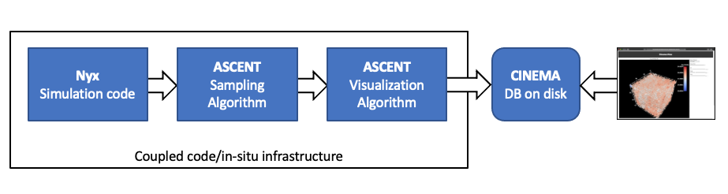
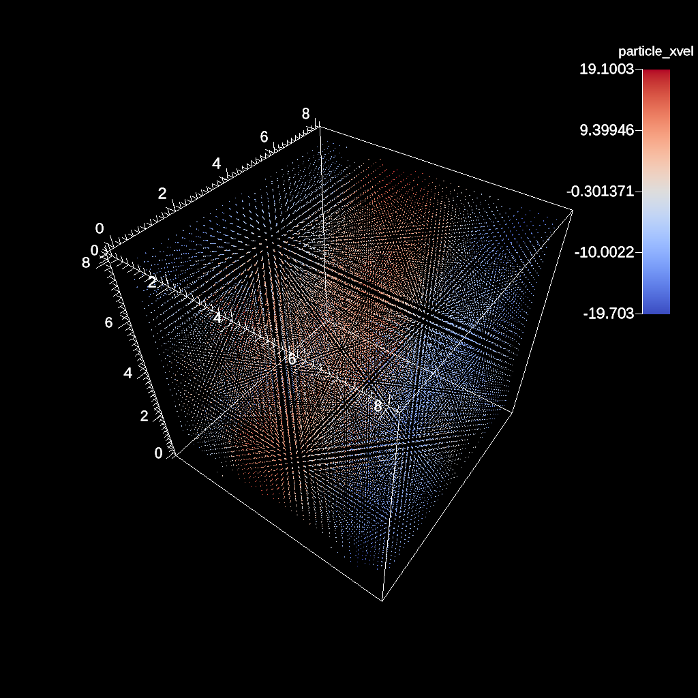
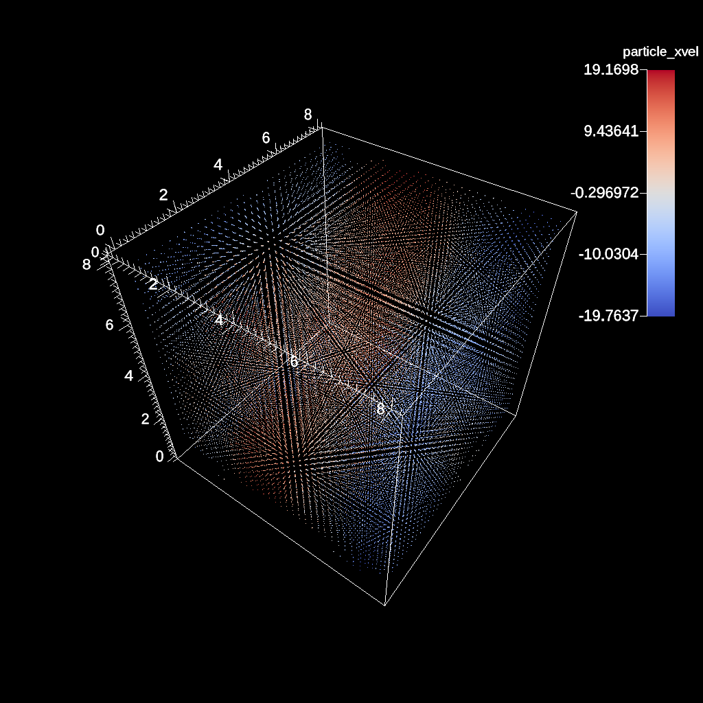

# Nyx in-situ sampling workflow

    

Diagram of the workflow in this example.

A repository for examples using `Nyx`, `Ascent`, in-situ creation of `Cinema`
databases, and post-processing analysis. 

Build instructions embedded in this workflow are derived from the Ascent build instructions [here](https://ascent.readthedocs.io/en/latest/BuildingAscent.html). This workflow uses **spack** to build all executables, from a specific commit.

This workflow can pull cached builds from a [E4S](https://e4s-project.github.io/) repository, if they exist
to speed up the build/install of requisite applications. If no cached builds are available, it will use
[spack](https://github.com/spack/spack) to build applications.

<table>
<tr>
<td>
<td>
<td>
</tr>
</table>

Images from the resulting Cinema database (used to validate run)

The workflow does the following:

- Creates a [Pantheon](http://pantheonscience.org/) environment and build location
- Clones a specific commit of [Spack](https://github.com/spack/spack)
- Uses `spack` to build [Ascent](https://ascent.readthedocs.io/en/latest/) and set up a coupled app/in-situ workflow
- Builds `Nyx` against the Ascent build.
- Runs a workflow to produce a [Cinema](https://cinemascience.org) database
- Installs a `Cinema` viewer, then packages up the results
- Verifies the `Cinema` database

## Using this repository

First, clone the repository, then:

- Edit the `bootstrap.env` file to include your compute allocation ID and the base path where installs and results should go.
- Execute the workflow by typing `./execute`. Take a look at this file to see the steps that are executed, and where to look for more detail.

